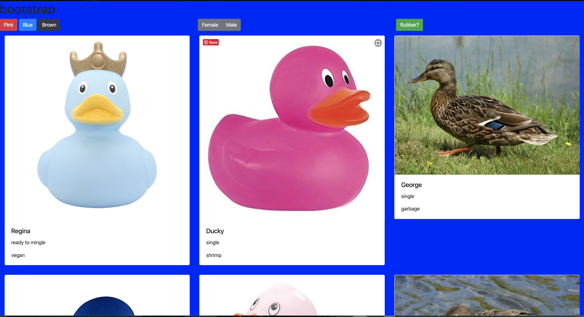

# bootstrap

## Description
This project is an exploratiom into the bootstrap grid system. we used boot strapcards
## Screenshot

## Instructions for how to run the project
1. Clone down this repo
1. make sure you have http-server installed via npm If not get it [HERE]()
1. On your comand lione run `hs -p`
1. In your browser go to `http:// localhost:999`